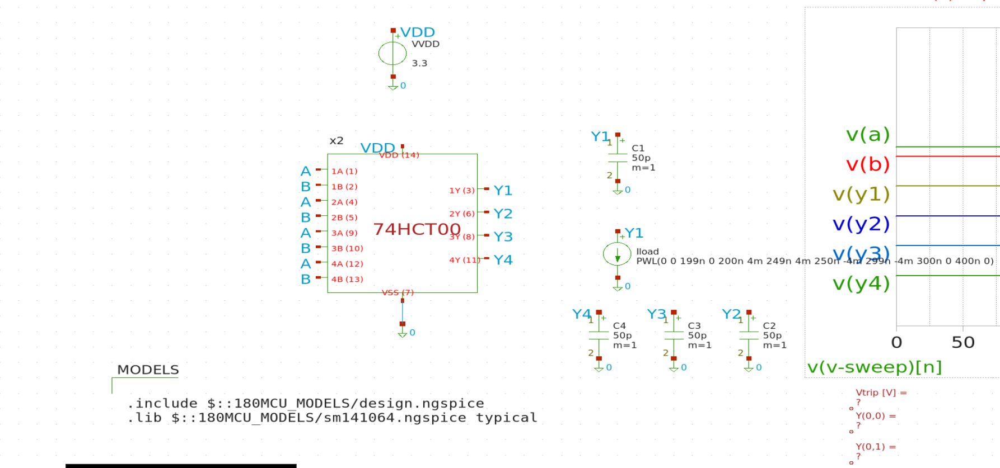
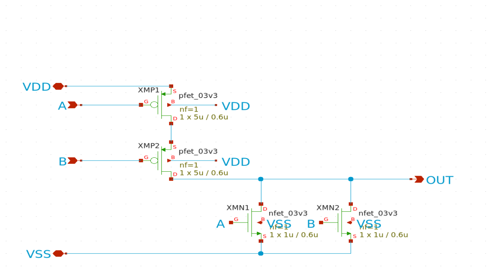

## How it works

This project is an open-source silicon implementation of **quad
2-input NAND** on the GlobalFoundries **gf180mcuD** process, operating from a
**3.3 V** supply. Each NAND gate presents a TTL-compatible input window
(V<sub>IL,max</sub> = 0.8 V, V<sub>IH,min</sub> = 2.0 V) and is sized for
**±4 mA** drive at the output.

The HCT input behaviour is realised through a skewed-inverter / NOR2 /
output-buffer chain rather than a plain CMOS NAND topology:

```
nand2_hct  =  inv_skewed (A) ─┐
              inv_skewed (B) ─┴─►  nor2  ──►  inv_out  ──►  Y
```

The four NAND gates share a common V<sub>DD</sub>/V<sub>SS</sub> rail pair.
Each gate output is routed to an analog pin in `ua[0..3]` rather than to the
digital pins, allowing V<sub>OH</sub> and V<sub>OL</sub> to be measured at
the rated ±4 mA drive without the digital output buffer of the TT pad frame
in series.

An additional analog pin `ua[4]` is wired to the same internal node as
`ui_in[0]` (the A input of gate 1), bypassing the TT digital input buffer.
This makes it possible to apply a slow DC sweep on `ua[4]` directly to the
gate's input and verify the HCT input window on silicon — a digital pad
would otherwise snap any intermediate voltage to 0 V or 3.3 V before it
reached the gate. Because the two pads share the same internal A1 node,
they must not be driven simultaneously.

## Schematics

The design was captured in **xschem** and simulated in **ngspice**. Per-cell
LVS was performed in KLayout.

Chip-level testbench (`tb_74hct00_top.sch`):



Top-level schematic (`74hct00_top.sch`):


NAND gate (`nand2_hct.sch`):


Interior NOR2 (`nor2.sch`):



## Pinout

Tile input pins mapped to NAND gate inputs:

| Tile pin   | Cell pin                                      |
|------------|-----------------------------------------------|
| `ui_in[0]` | A1 (Gate 1 input A)                           |
| `ui_in[1]` | B1 (Gate 1 input B)                           |
| `ui_in[2]` | A2 (Gate 2 input A)                           |
| `ui_in[3]` | B2 (Gate 2 input B)                           |
| `ui_in[4]` | A3 (Gate 3 input A)                           |
| `ui_in[5]` | B3 (Gate 3 input B)                           |
| `ui_in[6]` | A4 (Gate 4 input A)                           |
| `ui_in[7]` | B4 (Gate 4 input B)                           |
| `ua[4]`    | A1 (HCT-window probe; shared with `ui_in[0]`) |

Tile output pins mapped to NAND gate outputs:

| Tile pin | Cell pin            |
|----------|---------------------|
| `ua[0]`  | Y1 (Gate 1 output)  |
| `ua[1]`  | Y2 (Gate 2 output)  |
| `ua[2]`  | Y3 (Gate 3 output)  |
| `ua[3]`  | Y4 (Gate 4 output)  |

Power pins: `VDPWR` is the 3.3 V supply, `VGND` is ground.

## How to test

The procedure below is a basic functional verification of all four NAND gates.

1. Apply **3.3 V** between `VDPWR` and `VGND`.
2. For each gate *i* ∈ {1, 2, 3, 4}, drive the two input pins
   (A<sub>i</sub> on `ui_in[2i−2]`, B<sub>i</sub> on `ui_in[2i−1]`) to
   either 0 V or 3.3 V and read the corresponding output Y<sub>i</sub> on
   `ua[i−1]`. The output must follow the NAND truth table:

   | A | B | Y |
   |---|---|---|
   | 0 | 0 | 1 |
   | 0 | 1 | 1 |
   | 1 | 0 | 1 |
   | 1 | 1 | 0 |

3. *(Optional)* **HCT input-window check.** Disconnect `ui_in[0]` and apply
   a slow DC ramp on `ua[4]` from 0 V to 3.3 V while holding B<sub>1</sub>
   (`ui_in[1]`) at 3.3 V. Observe Y<sub>1</sub> on `ua[0]`. The output must
   remain at logic high for V<sub>in</sub> ≤ 0.8 V and must be at logic low
   for V<sub>in</sub> ≥ 2.0 V.

Note: `ui_in[0]` and `ua[4]` are connected to the same internal
A<sub>1</sub> node and must not be driven simultaneously.

## External hardware

- 3.3 V DC power supply (≥ 50 mA capable).
- Digital multimeter for output-voltage measurement.
- (Optional) Variable low-voltage DC source for the HCT input-window check.
